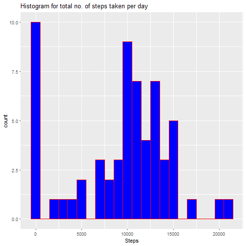

Reproducible Research - Week 2 Project
=====================================
Load the required libraries

```r
library(dplyr)
library(ggplot2)
library(stringr)
library(lubridate)
library(purrr)
```
Function to impute missing values in 'Steps'.  
If the passed in steps is NA, get the rounded average steps taken for the interval
from steps_by_interval. Else, return the passed in value.

```r
impute.steps <- function(steps, date, time){
  if(is.na(steps)){
      return(round(steps_by_interval[steps_by_interval$time == time, "avg_steps"]))
  }else{
    return(steps)
  }
}
```
Function to determine if the passed-in date is a weekday or a weekend.

```r
day.of.week <- function(date){
  if(weekdays(date) %in% c("Saturday", "Sunday")){
    return("Weekend")
  }else{
    return("Weekday")
  }
}
```
Download the data file (in .zip) from the course page if not found in the working directory.

```r
if(!file.exists("activity.csv")){
  if(!file.exists("repdata%2Fdata%2Factivity.zip")){
    file.url <- "https://d396qusza40orc.cloudfront.net/repdata%2Fdata%2Factivity.zip"
    download.file(file.url, destfile = "repdata%2Fdata%2Factivity.zip")
    unzip("repdata%2Fdata%2Factivity.zip")
  } else {
    unzip("repdata%2Fdata%2Factivity.zip")
  }
}
```
Read the data file

```r
orig_data <- read.csv("activity.csv", 
                      na.strings = "NA", 
                      colClasses = c("integer", "Date", "character"))
```
Convert the interval field to a character vector to store the interval in HH::MM format.

```r
orig_data <- orig_data %>%
             mutate(time = as.POSIXct(str_pad(orig_data$interval, 
                                              width = 4, 
                                              side = "left", 
                                              pad = "0"), 
                                      format = "%H%M")) %>%
             mutate(time = paste(str_pad(hour(time), 
                                         width = 2, 
                                         side = "left", 
                                         pad = "0"),
                                 str_pad(minute(time), 
                                         width = 2, 
                                         side = "left", 
                                         pad = "0"), 
                                 sep = ":"))  
```
Group by date & calculate the total number of steps per day.

```r
steps_by_date <- orig_data %>%
                 group_by(date) %>%
                 summarize(Total.no.of.steps = sum(steps, na.rm = TRUE))
```
Histogram of the total number of steps taken per day

```r
p <- qplot(steps_by_date$Total.no.of.steps,
           geom="histogram",
           binwidth = 1000,  
           main = "Histogram for total no. of steps taken per day", 
           xlab = "Steps",  
           fill=I("blue"), 
           col=I("red"))
print(p)
```



Calculate mean & median of the total number of steps taken

```r
print(paste("The mean number of steps is",mean(steps_by_date$Total.no.of.steps)))
```

```
## [1] "The mean number of steps is 9354.22950819672"
```

```r
print(paste("The median of the number of steps is",median(steps_by_date$Total.no.of.steps)))
```

```
## [1] "The median of the number of steps is 10395"
```
Group by 5 minute data interval & calculate the average no. of steps per interval

```r
steps_by_interval <- orig_data %>%
                     group_by(time) %>%
                     summarize(avg_steps = mean(steps, na.rm = TRUE))
```
Time series plot of the average of steps taken during each 5 minute intervals

```r
p <- ggplot(data = steps_by_interval, 
            mapping = aes(x = time, 
                          y = avg_steps, 
                          group = 1)) + 
     geom_line(color = "blue") + 
     scale_x_discrete(breaks = c("00:00", "04:00", "08:00", "12:00", "16:00", "20:00", "23:30")) +
     xlab("Interval") +
     ylab("Average No. of Steps") +
     ggtitle("Average no. of steps across 5-minute intervals")
print(p)
```


5- minute interval with the maximum average number of steps

```r
print(paste("The",steps_by_interval[which.max(steps_by_interval$avg_steps),"time"],
      "time interval has the maximum average number of steps"))
```

```
## [1] "The 08:35 time interval has the maximum average number of steps"
```
Print the total number of missing values in the data set

```r
print(paste("The data set has", sum(is.na(orig_data)),"missing values"))
```

```
## [1] "The data set has 2304 missing values"
```
Copy original data to a new data frame

```r
imputed_data <- orig_data 
```
Prepare the list of arguments to be passed to impute.steps using pmap()

```r
impute_list <- list(steps = orig_data$steps, 
                    date = orig_data$date,
                    time = orig_data$time)
```
Call impute.steps using pmap by passing in values from orig_data as arguments and
create a new column in the imputed data frame using the returned values.

```r
imputed_data$steps.impute <- unlist(pmap(impute_list, impute.steps))
```
Group by date & calculate the total number of steps per day.

```r
steps_by_date_imputed <- imputed_data %>%
                         group_by(date) %>%
                         summarize(Total.no.of.steps = sum(steps.impute))
```
Histogram of the total number of steps taken per day using the imputed data

```r
p <- qplot(steps_by_date_imputed$Total.no.of.steps,
           geom="histogram",
           binwidth = 1000,  
           main = "Histogram for total no. of steps taken per day using imputed data", 
           xlab = "Steps",  
           fill=I("blue"), 
           col=I("red"))
print(p)
```


Calculate mean & median of the total number of steps taken using the imputed data

```r
print(paste("The mean number of steps is", 
            mean(steps_by_date_imputed$Total.no.of.steps),
            "using imputed data"))
```

```
## [1] "The mean number of steps is 10765.6393442623 using imputed data"
```

```r
print(paste("The median of the number of steps is", 
            median(steps_by_date_imputed$Total.no.of.steps),
            "using imputed data"))
```

```
## [1] "The median of the number of steps is 10762 using imputed data"
```
Compare mean & median of the original & imputed data sets.

```r
print(paste("The difference between the mean number of steps for original & imputed data sets is",
            mean(steps_by_date_imputed$Total.no.of.steps) - mean(steps_by_date$Total.no.of.steps)))
```

```
## [1] "The difference between the mean number of steps for original & imputed data sets is 1411.40983606558"
```

```r
print(paste("The difference between the median of the number of steps for original & imputed data sets is",
            median(steps_by_date_imputed$Total.no.of.steps) - median(steps_by_date$Total.no.of.steps)))
```

```
## [1] "The difference between the median of the number of steps for original & imputed data sets is 367"
```
Add a new column to the imputed data frame to indicate if the day was a Weekend 
or a weekday.

```r
imputed_data$day.of.week <- unlist(map_chr(imputed_data$date, day.of.week))
```
Group by day of week and the 5-minute time interval

```r
steps_by_interval_imputed <- imputed_data %>%
                             group_by(day.of.week, time) %>%
                             summarize(avg_steps = mean(steps.impute))

p <- ggplot(data = steps_by_interval_imputed, 
            mapping = aes(x = time, 
                          y = avg_steps, 
                          group = 1,
                          col = day.of.week)) + 
     geom_line(color = "blue") + 
     scale_x_discrete(breaks = c("00:00", "04:00", "08:00", "12:00", "16:00", "20:00", "23:30")) +
     xlab("Interval") +
     ylab("Average No. of Steps") +
     ggtitle("Average no. of steps across 5-minute intervals") +
     facet_grid(day.of.week~.)
print(p)
```


